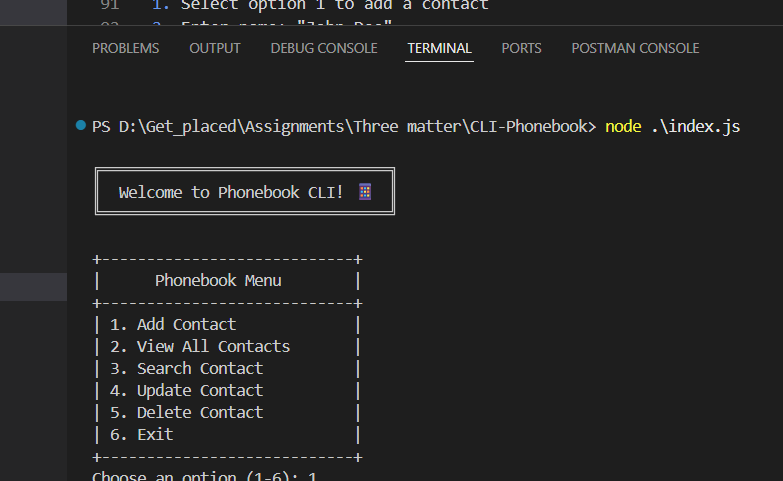
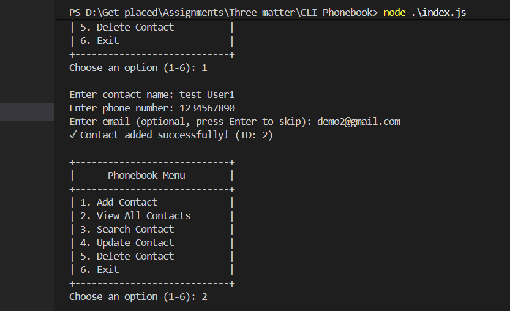

# 📱 Phonebook CLI Application

A CLI-based Phonebook application built with JavScript (Node.Js runtime) and Node core modules.

## Features

✨ **Add Contact** - Create new contacts with name, phone, and optional email
📋 **View All Contacts** - Display all stored contacts in formatted list
🔍 **Search Contacts** - Find contacts by partial name (case-insensitive)
✏️ **Update Contact** - Modify existing contact information
🗑️ **Delete Contact** - Remove contacts with confirmation
🚀 **Exit** - Cleanly exit the application

## Quick Start

### Prerequisites

- Node.js v12 or higher
- No external dependencies

### Installation & Running

```bash
# Clone or download the project
cd CLI-Phonebook

# Run the application
node start
```

The application will start and display the main menu.

## Project Structure

```
CLI-Phonebook/
├── src/
│   ├── models/
│   │   └── Contact.js           # Contact data model
│   ├── services/
│   │   └── ContactService.js    # Business logic & CRUD operations
│   ├── storage/
│   │   └── FileStorage.js       # Data persistence (JSON file)
│   ├── ui/
│   │   └── Menu.js              # CLI user interface
│   └── utils/
│       ├── validators.js        # Input validation
│       └── idGenerator.js       # Unique ID generation
├── index.js                      # Application entry point
├── contacts.json                 # Data storage (auto-created)
└── package.json                  # Project metadata
```

## Architecture

This project implements a **professional 3-Layer Architecture**:

1. **Presentation Layer** (`src/ui/Menu.js`)
   - Handles user interaction via CLI
   - Collects and displays information

2. **Business Logic Layer** (`src/services/ContactService.js`)
   - CRUD operations
   - Data validation
   - Business rule enforcement

3. **Data Access Layer** (`src/storage/FileStorage.js`)
   - File I/O operations
   - JSON persistence
   - Abstraction for easy storage migration

## Usage

After running `node index.js`, you'll see a menu:

```
╔════════════════════════════════╗
║      📱 Phonebook Menu         ║
╠════════════════════════════════╣
║  1. Add Contact                ║
║  2. View All Contacts          ║
║  3. Search Contact             ║
║  4. Update Contact             ║
║  5. Delete Contact             ║
║  6. Exit                       ║
╚════════════════════════════════╝
```

**Example Flow:**

1. Select option 1 to add a contact
2. Enter name: "Demo User"
3. Enter phone: "1234567890"
4. Enter email: "demo@example.com"
5. Contact saved! View it with option 2

## Screenshots

_Add your application screenshots here_

| Main Menu | Add Contact | View Contacts |
|----------|------------|--------------|
|  |  |  |


## Key Features

- ✅ **No External Dependencies** - Uses only Node.js core modules (fs, readline, path)
- ✅ **Input Validation** - Validates name, phone, and email format
- ✅ **Duplicate Prevention** - Prevents duplicate phone numbers
- ✅ **Auto-save** - Data persists to file after every operation
- ✅ **Error Handling** - User-friendly error messages
- ✅ **Professional Architecture** - Layered design for scalability


## Requirements Met

- ✅ CRUD Operations (Create, Read, Update, Delete)
- ✅ CLI-based user interface
- ✅ JSON file storage
- ✅ No backend framework used
- ✅ Node.js core modules only

---
Made with ❤️ by Himanshu Suyawanshi